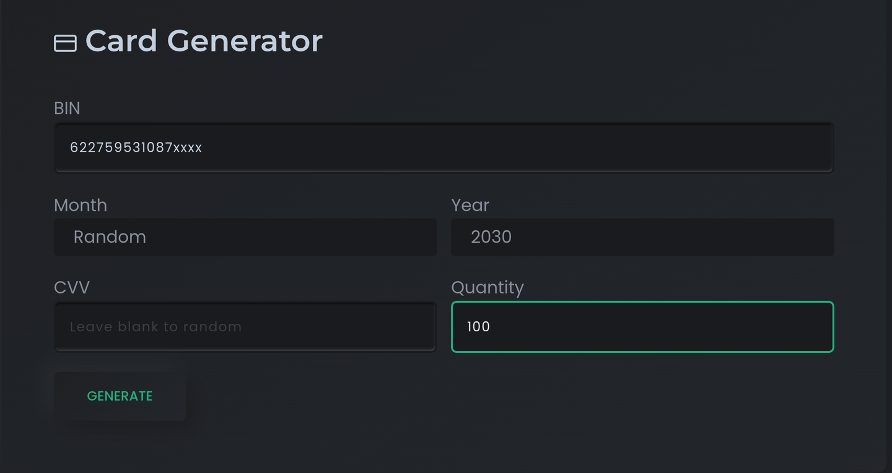
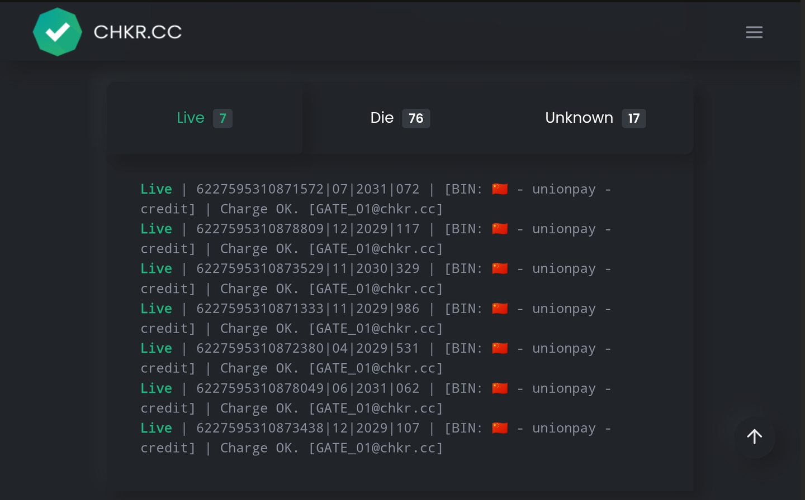
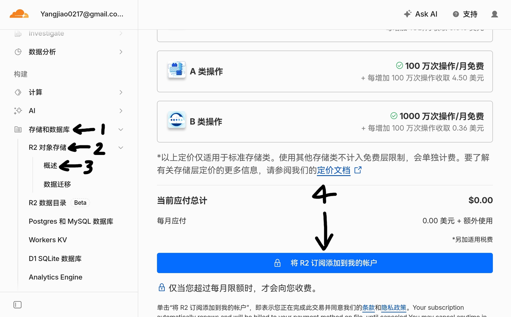

### 参考
[参考文章地址](https://jiaoblog.dpdns.org/feed/9)

本文章用于备份一下文档，具体可以参看上面的地址

### 准备网址
- 信用卡号生成与验活(包括卡BIN生成)：https://chkr.cc/
- 地址生成器：https://meiguodizhi.com
一个可以通过cf支付网关验证的卡段，这里我为大家提供几个：(实测第三个卡段的成功率最高)
```javascript
601121255660xxxx
546775142533xxxx
622759531087xxxx
479229938031xxxx
```
 打开https://chkr.cc/
点击页面中的「⚙️」在弹出的页面中: 「BIN」填写上面给出的卡段，「Year」可以把年份改到3到5年以后(不用卡片到期后频繁生成新卡片)，「Quantity」是生成的卡片数量(一般填写50-100可以保证一轮即可检测出可以卡片，且检测时间不算长)，「Month」和「CVV」不用填写。然后点击下方的GENERATE



点击「⚙️」上方的**「▶️」**图标，开始检测卡片信息，请等待进度条至100%



#### 分享一下卡号
```javascript
|6227595310872182|06|2030|186|
|6227595310876548|04|2030|617|
|6227595310875326|04|2030|741|
|6227595310871135|04|2030|912|
|6227595310878692|09|2030|249|
```

### 生成虚拟地址
打开地址生成器，然后选择该卡片对应地区的地址生成
随便生成一个地址即可

### 填写付款信息
打开Cloudflare仪表盘
点击「存储和数据库」→「R2 对象存储」→「概述」此时会提示R2的收费标准，请点击下方的「将 R2 订阅到我的账户」




