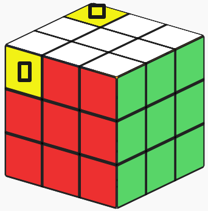
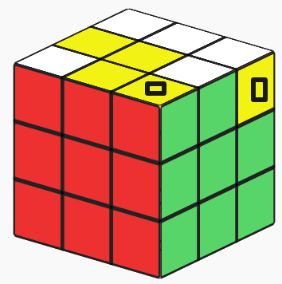
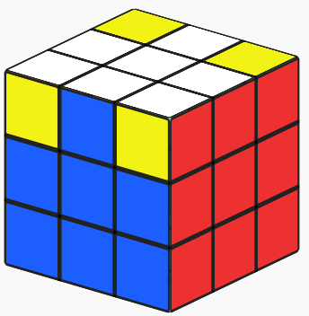

## 小鱼公式

**顺**：`R U' R' U' R U' U' R'` —— 放在左手边

**倒**：`R' U U R U R' U R` —— 放在右手边

**F 系列**：`F R U R' U' F'` —— 朝上的黄色块一侧放在右手边

## 其他常用公式

- `R U R' U' R' F R F`
- `F R U R' U' R U R' U' F'`
- `F R U R' U' R U R' U' R U R' U' F'`
