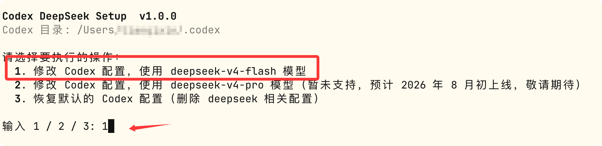
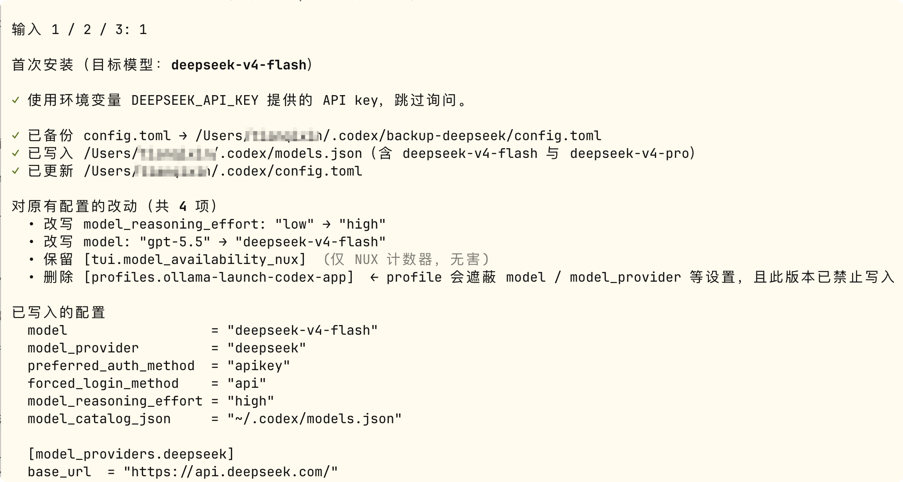
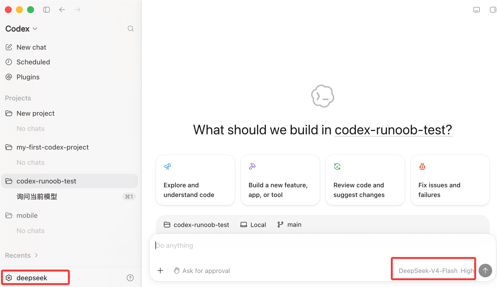

## 将 DeepSeek 配置为模型提供方

DeepSeek 官方提供了两种接入方式，推荐优先使用方式一。

### 方式一：一键配置脚本（推荐）

macOS / Linux，在终端执行：

bash <(curl -fsSL https://cdn.deepseek.com/api-docs/codex-deepseek-setup.sh)

Windows，在 PowerShell 中执行：

irm https://cdn.deepseek.com/api-docs/codex-deepseek-setup-en.ps1 | iex

运行后按菜单提示选择要使用的模型，首次运行会要求输入你的 API Key。

我们第一次运行，选择 1 选项 修改 Codex 配置，使用 deepseek-v4-flash 模型：

后期我们要恢复默认配置，也可以执行这个脚本，并选择 3 来恢复。

接下来会提示 API key 输入，如果已经在环境变量中配置过会使用环境变量 DEEPSEEK_API_KEY 提供的 API key，跳过询问：

之后重新 ChatGPT，就可以看到 DeepSeek 的模型了：

这个脚本会自动完成以下工作：

- **备份现有配置**：把 ~/.codex/config.toml 备份到 ~/.codex/backup-deepseek/，方便随时还原。
    
- **写入模型目录 ~/.codex/models.json**：向 Codex 声明 DeepSeek 模型的元数据（上下文窗口长度、支持的推理强度档位、工具调用格式等），使 Codex 能像调用内置模型一样调用 DeepSeek。
    

- **修改 ~/.codex/config.toml**：只改写必要字段（见下文字段说明），新增 [model_providers.deepseek] 配置段，原有的 MCP 服务器、项目信任级别等配置都会保留，若发现有冲突字段会自动删除并打印删除原因。
    
- **语法校验**：写入前会先校验 config.toml / models.json 的合法性，校验不通过则中止，不会破坏原有文件。

之后随时可以再次运行该脚本，用来切换模型，或者恢复到安装前的默认配置（菜单里的第 3 项）。
